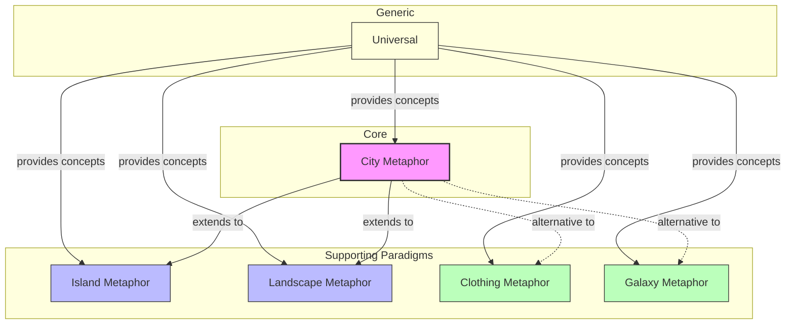

# Bounded Context Index

> Context map for software city visualization paradigms.

---

## Overview

This knowledge base covers multiple visualization paradigms, each representing a distinct **bounded context** with its own ubiquitous language. Terms may have different meanings across contexts.

## Context Map

## Contexts

| ID | Context | Type | Description | Features |
|----|---------|------|-------------|----------|
| BC001 | [[city-metaphor]] | core | 3D city with buildings/districts | 45+ |
| BC002 | [[island-metaphor]] | supporting | Archipelago for modular systems | 5+ |
| BC003 | [[landscape-metaphor]] | supporting | Multi-application landscape | 3+ |
| BC004 | [[clothing-metaphor]] | supporting | Wardrobe/garment visualization | 3 |
| BC005 | [[galaxy-metaphor]] | supporting | Constellation/semantic clustering | 2 |
| BC006 | [[universal]] | generic | Cross-paradigm concepts | 30+ |

## Context Types

| Type | Description | Investment |
|------|-------------|------------|
| **Core** | Competitive advantage; deepest domain expertise | Highest |
| **Supporting** | Enables core; could be simplified | Medium |
| **Generic** | Solved problems; reuse where possible | Minimal |

## Relationship Legend

| Arrow | Meaning |
|-------|---------|
| `A --> B` | A is upstream (provides to) B |
| `A -.-> B` | Alternative approaches |
| `A --- B` | Shared kernel |

## Integration Patterns

| From | To | Pattern | Notes |
|------|----|---------|-------|
| Universal | All | Shared Kernel | Common metrics, layouts, interactions |
| City Metaphor | Island Metaphor | Extension | Island contains city structure |
| City Metaphor | Landscape Metaphor | Extension | Landscape contains multiple cities |
| City Metaphor | Clothing Metaphor | Alternative | Different visualization paradigm |
| City Metaphor | Galaxy Metaphor | Alternative | Different visualization paradigm |

---

## Statistics

- **Total contexts**: 6
- **Core contexts**: 1
- **Supporting contexts**: 4
- **Generic contexts**: 1
- **Last updated**: 2026-01-05
