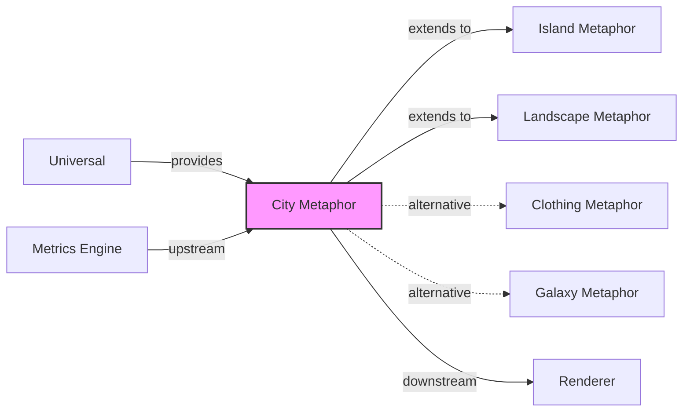

# City Metaphor

## Purpose

The city metaphor is the **core domain** of software visualization in this knowledge base. It depicts software systems as 3D cities where code structures (classes, files, functions) become buildings, organizational structures (packages, folders) become districts, and the resulting cityscape enables intuitive understanding of system size, structure, and properties.

This context owns the fundamental visualization paradigm that other contexts extend or provide alternatives to.

## Ubiquitous Language

Key terms defined in this context:

| Term | Definition | DDD Type |
|------|------------|----------|
| [[building]] | 3D visual element representing a software entity | entity |
| [[district]] | Visual grouping corresponding to a package/directory | entity |
| [[brick]] | Small cuboid representing a method (fine-grained view) | entity |
| [[locality]] | Stable spatial placement for orientation | concept |
| [[habitability]] | Property of supporting sustained exploration | concept |
| [[skyline]] | Characteristic height profile of the city | value-object |

## Aggregates

| Aggregate Root | Key Entities | Key Invariants |
|----------------|--------------|----------------|
| SoftwareCity | District, Building, Edge | Every building belongs to exactly one district; district hierarchy is a tree |
| CityConfiguration | HeightScale, ColorScale, BaseScale | Scale min < max; default metric is valid |
| CityView | Camera, Selection, Tags | Selection is subset of visible entities |

## Context Map

## Relationships

| Related Context | Relationship | Pattern | Integration |
|-----------------|--------------|---------|-------------|
| Universal | upstream | Shared Kernel | Common metrics, layouts, interactions |
| Island Metaphor | downstream | Extension | Islands contain city structure internally |
| Landscape Metaphor | downstream | Extension | Landscapes contain multiple cities |
| Clothing Metaphor | peer | Alternative | Different visualization paradigm |
| Galaxy Metaphor | peer | Alternative | Different visualization paradigm |

### Upstream Dependencies (what we consume)

**Universal Context**
- We need: Metric definitions, layout algorithms, navigation patterns
- Contract: Shared type definitions in glossary/taxonomy
- ACL: No — terms have same meaning

### Downstream Consumers (what we provide)

**Island Metaphor**
- They need: Building/district rendering for island internals
- Contract: Same visual elements, applied at island scope

**Landscape Metaphor**
- They need: Complete city as a unit within landscape
- Contract: City as positioned element in landscape space

## Features in This Context

| ID | Feature | Status | Notes |
|----|---------|--------|-------|
| [[F001]] | City Metaphor | canonical | The paradigm itself |
| [[F002]] | Class-as-Building | canonical | Primary entity mapping |
| [[F003]] | Function-as-Building | variant | JavaScript/procedural variant |
| [[F004]] | Component-as-Building | variant | Architectural unit mapping |
| [[F017]] | Package-as-District | canonical | Hierarchy mapping |
| [[F021]] | Stacked-Platform Topology | canonical | Nested districts at altitude |
| [[F027]] | Method-as-Bricks | variant | Fine-grained method view |
| [[F038]] | File-as-Building | variant | File-level granularity |
| [[F043]] | Nested-Functions-as-Stacked-Buildings | variant | JavaScript nested functions |
| [[F044]] | Module-as-Building | variant | AMD/ES module mapping |
| [[F045]] | Method-as-Floors | variant | Floor-based method representation |
| [[F054]] | Class-as-District | variant | Inverted hierarchy |

## Domain Events Published

| Event | When | Consumed By |
|-------|------|-------------|
| CityGenerated | Layout computation complete | Renderer, Cache, Analytics |
| BuildingSelected | User selects building | Inspector, IDE Bridge |
| ViewConfigurationChanged | User changes mapping | Renderer |
| DistrictExpanded | User expands district | Layout Engine |

## Domain Events Consumed

| Event | From | Reaction |
|-------|------|----------|
| MetricsComputed | Metrics Engine | Trigger property mapping |
| SourceChanged | IDE/VCS | Regenerate affected buildings |

## Key Implementations

| Implementation | Status | Notes |
|----------------|--------|-------|
| CodeCity | historical | Original Smalltalk implementation |
| CodeCharta | active | Modern web-based, file-level |
| GoCity | active | Go-specific |
| JSCity | active | JavaScript-specific |
| SoftVis3D | maintained | SonarQube integration |
| CodeMetropolis | active | Minecraft-based |

## Open Questions

- How should cities handle extreme scale (100k+ buildings)?
- What is the right balance between metaphor fidelity and practical utility?
- Should city layouts be stable across versions, or optimize for current snapshot?

## History

- **2007**: CodeCity introduced by Wettel & Lanza (CC023)
- **2008**: PhD thesis formalizes the approach (CC035)
- **2011**: Controlled experiment validates effectiveness (CC025)
- **2017+**: Multiple implementations emerge (CodeCharta, GoCity, JSCity)
