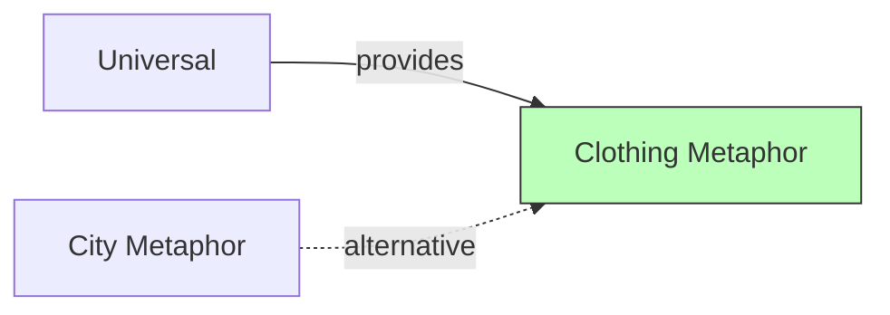

# Clothing Metaphor

## Purpose

The clothing metaphor provides an **alternative visualization paradigm** where software classes are represented as garments in a wardrobe. Quality metrics are encoded in garment attributes (size, collar, stripes, color). This context explores whether non-spatial metaphors can support program comprehension, particularly for developers who may find 3D navigation challenging.

## Ubiquitous Language

Key terms defined in this context:

| Term | Definition | DDD Type |
|------|------------|----------|
| garment | Visual representation of a class | entity |
| wardrobe | Collection of garments (the system) | aggregate |
| collar | Garment attribute encoding a metric (e.g., WMC) | value-object |
| stripes | Garment attribute encoding another metric | value-object |
| clothing-size | Garment dimension encoding complexity | value-object |

## Aggregates

| Aggregate Root | Key Entities | Key Invariants |
|----------------|--------------|----------------|
| Wardrobe | Garment | Each class maps to one garment |
| Garment | Collar, Stripes, Size | Attributes derived from class metrics |

## Context Map

## Relationships

| Related Context | Relationship | Pattern | Integration |
|-----------------|--------------|---------|-------------|
| Universal | upstream | Shared Kernel | Metrics, selection |
| City Metaphor | peer | Alternative | Different paradigm, same domain |

### Key Differences from City Metaphor

| Aspect | City Metaphor | Clothing Metaphor |
|--------|---------------|-------------------|
| Primary element | 3D building | 2D garment silhouette |
| Spatial layout | Hierarchical districts | Flat wardrobe grid |
| Navigation | 3D fly/walk | 2D scroll/filter |
| Metric encoding | Height, base, color | Size, collar, stripes, color |

## Features in This Context

| ID | Feature | Status | Notes |
|----|---------|--------|-------|
| [[F072]] | Clothing Metaphor | variant | The paradigm itself |
| [[F073]] | Class-as-Clothing-Item | variant | Entity mapping |
| [[F074]] | Clothing Attribute Mapping | variant | Property mappings |

## Domain Events Published

| Event | When | Consumed By |
|-------|------|-------------|
| WardrobeGenerated | Layout complete | Renderer |
| GarmentSelected | User clicks garment | Inspector |

## Key Implementations

| Implementation | Status | Notes |
|----------------|--------|-------|
| CodeVestimenta | research | Eclipse plugin |

## Evidence

- CC041: Controlled study comparing clothing metaphor to city metaphor
- Found comparable task performance with different user preferences

## Open Questions

- Can clothing metaphor scale to large systems (1000+ classes)?
- How to represent package hierarchy in a flat wardrobe?
- Is the metaphor intuitive for users unfamiliar with fashion?

## History

- **2024**: CodeVestimenta introduced (CC041)
- Controlled study conducted with student participants
