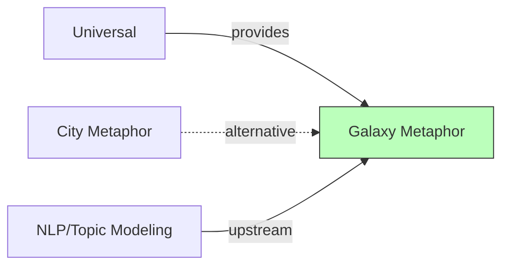

# Galaxy Metaphor

## Purpose

The galaxy metaphor provides an **alternative visualization paradigm** where software files are represented as stars, and semantic clusters (derived from NLP/LDA topic analysis) form nebulae. Unlike the city metaphor which uses structural hierarchy (packages/folders), the galaxy metaphor uses **semantic similarity** to position elements — files with similar vocabulary cluster together regardless of their location in the file system.

This context explores whether semantic relationships can provide insights that structural visualization misses.

## Ubiquitous Language

Key terms defined in this context:

| Term | Definition | DDD Type |
|------|------------|----------|
| star | Visual representation of a file | entity |
| nebula | Cluster of semantically similar files | aggregate |
| constellation | The complete visualization | aggregate |
| [[semantic-cluster]] | Group derived from topic modeling | value-object |
| [[semantic-layout]] | Position based on semantic similarity | concept |

## Aggregates

| Aggregate Root | Key Entities | Key Invariants |
|----------------|--------------|----------------|
| Constellation | Nebula, Star | Stars belong to at most one nebula; nebulae don't overlap |
| SemanticModel | Topic, TopicAssignment | Topics are orthogonal; each file has topic distribution |

## Context Map

## Relationships

| Related Context | Relationship | Pattern | Integration |
|-----------------|--------------|---------|-------------|
| Universal | upstream | Shared Kernel | Metrics, selection |
| City Metaphor | peer | Alternative | Different paradigm |
| NLP/Topic Modeling | upstream | Customer-Supplier | LDA topic vectors |

### Key Differences from City Metaphor

| Aspect | City Metaphor | Galaxy Metaphor |
|--------|---------------|-----------------|
| Layout basis | Structural hierarchy | Semantic similarity |
| Grouping | Package/folder | Topic cluster |
| Position meaning | Parent container | Similar vocabulary |
| Primary insight | Structure, size | Conceptual cohesion |

### Upstream Dependencies (what we consume)

**NLP/Topic Modeling**
- We need: Topic vectors for each file
- Contract: LDA model output (topic×document matrix)
- ACL: Yes — translate topic vectors to positions

## Features in This Context

| ID | Feature | Status | Notes |
|----|---------|--------|-------|
| [[F076]] | Galaxy Metaphor | variant | The paradigm itself |
| [[F077]] | Semantic-Similarity Layout | experimental | Position by topic similarity |

## Domain Events Published

| Event | When | Consumed By |
|-------|------|-------------|
| ConstellationGenerated | Layout complete | Renderer |
| NebulaFocused | User zooms to cluster | Inspector |
| TopicHighlighted | User selects topic | All stars in topic |

## Key Implementations

| Implementation | Status | Notes |
|----------------|--------|-------|
| (Research prototype) | research | Described in CC157 |

## Open Questions

- How to handle files that span multiple topics?
- What number of topics produces meaningful clustering?
- Can this complement city metaphor (semantic overlay on city)?
- How to visualize topic evolution over time?

## History

- **2024+**: Galaxy metaphor proposed (CC157)
- Explores semantic layout as alternative to structural layout
