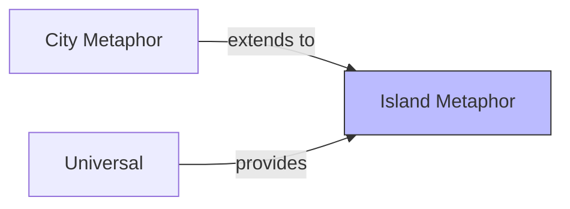

# Island Metaphor

## Purpose

The island metaphor extends the city metaphor to visualize **modular software architectures** (OSGi bundles, microservices, npm packages). Each module becomes an island in an archipelago, with the island's internal structure using city-like buildings and districts. The water/coastline represents module boundaries, making architecture-level structure visible.

This context supports the core city metaphor by providing a higher-level view for component-based systems.

## Ubiquitous Language

Key terms defined in this context:

| Term | Definition | DDD Type |
|------|------------|----------|
| [[island]] | Landmass representing a module/bundle | entity |
| coastline | Boundary of an island (module boundary) | value-object |
| water | Space between islands (no direct coupling) | concept |
| archipelago | Collection of islands (the system) | aggregate |
| bridge | Connection between islands (inter-module dependency) | entity |

## Aggregates

| Aggregate Root | Key Entities | Key Invariants |
|----------------|--------------|----------------|
| Archipelago | Island, Bridge | Islands don't overlap; bridges connect existing islands |
| Island | Region, Building | Internal structure follows city rules |

## Context Map

## Relationships

| Related Context | Relationship | Pattern | Integration |
|-----------------|--------------|---------|-------------|
| City Metaphor | upstream | Extension | Islands contain city structure |
| Universal | upstream | Shared Kernel | Common interactions, metrics |

### Upstream Dependencies (what we consume)

**City Metaphor**
- We need: Building/district rendering for island internals
- Contract: Same entity mappings (class→building, package→district)
- ACL: No — terms compatible

**Universal**
- We need: Navigation, selection, metrics
- Contract: Standard interaction patterns

## Features in This Context

| ID | Feature | Status | Notes |
|----|---------|--------|-------|
| [[F068]] | Island Metaphor | variant | The paradigm itself |

## Domain Events Published

| Event | When | Consumed By |
|-------|------|-------------|
| ArchipelagoGenerated | Island layout complete | Renderer |
| IslandFocused | User zooms to island | Camera, City Generator |
| BridgeHighlighted | Dependency selected | Inspector |

## Key Implementations

| Implementation | Status | Notes |
|----------------|--------|-------|
| IslandViz | research | VR/AR for OSGi architectures |

## Open Questions

- How to handle islands with vastly different sizes (10 classes vs 1000)?
- Should bridges show direction/strength of coupling?
- How to represent cyclic dependencies between islands?

## History

- **2019**: IslandViz introduces island metaphor for OSGi (CC070)
- **2019**: HoloLens AR version demonstrated (CC070)
