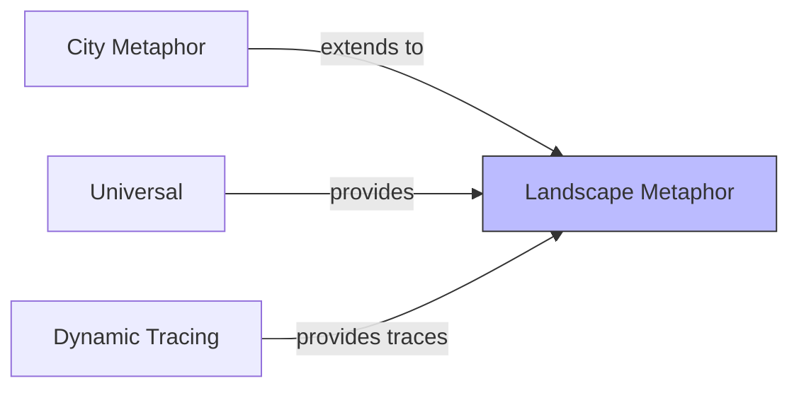

# Landscape Metaphor

## Purpose

The landscape metaphor extends the city metaphor to visualize **multi-application systems** and their runtime relationships. Multiple software cities are placed within a larger landscape, with communication traces visualized as connections between applications. This context supports understanding of distributed systems, microservices architectures, and application portfolios.

## Ubiquitous Language

Key terms defined in this context:

| Term | Definition | DDD Type |
|------|------------|----------|
| [[software-landscape]] | Set of applications and their deployment context | aggregate |
| application | A deployed software system (rendered as a city) | entity |
| system | Container/server hosting applications | entity |
| trace | Runtime communication between applications | entity |
| live-trace-visualization | Real-time display of execution traces | concept |

## Aggregates

| Aggregate Root | Key Entities | Key Invariants |
|----------------|--------------|----------------|
| SoftwareLandscape | System, Application, Trace | Applications belong to systems; traces connect applications |

## Context Map

## Relationships

| Related Context | Relationship | Pattern | Integration |
|-----------------|--------------|---------|-------------|
| City Metaphor | upstream | Extension | Each application is a city |
| Universal | upstream | Shared Kernel | Navigation, selection |
| Dynamic Tracing | upstream | Customer-Supplier | Trace data via Kieker/OpenTelemetry |

### Upstream Dependencies (what we consume)

**City Metaphor**
- We need: Application-level city rendering
- Contract: City as positioned element

**Dynamic Tracing**
- We need: Runtime trace data (calls, timing)
- Contract: OpenTelemetry/Kieker trace format
- ACL: Yes — translate trace format to domain events

## Features in This Context

| ID | Feature | Status | Notes |
|----|---------|--------|-------|
| [[F041]] | Software Landscape View | variant | Multi-application overview |
| [[F069]] | Time-Shift Mode | variant | Rewind live traces |

## Domain Events Published

| Event | When | Consumed By |
|-------|------|-------------|
| LandscapeUpdated | New trace data received | Renderer |
| ApplicationFocused | User drills into app | City Generator |
| TraceReplayed | Time-shift navigation | Trace Visualizer |

## Key Implementations

| Implementation | Status | Notes |
|----------------|--------|-------|
| ExplorViz | active | Live trace visualization, VR support |

## Open Questions

- How to handle landscapes with hundreds of applications?
- What aggregation level for traces (method, class, service)?
- How to represent async vs sync communication?

## History

- **2013+**: ExplorViz develops landscape metaphor (CC053)
- **2020**: Multi-user VR collaboration added
