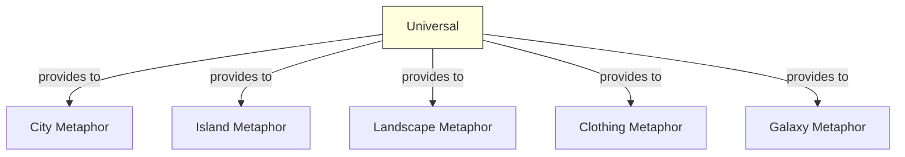

# Universal Context

## Purpose

The universal context contains **cross-paradigm concepts** that apply to any software visualization metaphor. These are solved problems that should be reused rather than reinvented: metrics, property mappings, layout algorithms, navigation patterns, selection mechanisms, and platform concerns.

This is a **generic** context — investment should be minimal, focusing on reuse and standardization.

## Ubiquitous Language

Key terms defined in this context:

| Term | Definition | DDD Type |
|------|------------|----------|
| [[metric]] | Quantitative measurement of a software property | value-object |
| [[property-mapping]] | Transformation from metric to visual attribute | domain-service |
| [[layout]] | Spatial arrangement algorithm | domain-service |
| [[selection]] | Set of entities marked for inspection | entity |
| [[navigation]] | Camera/viewpoint movement patterns | concept |
| [[query-filtering]] | Selecting entities by criteria | domain-service |

## Aggregates

| Aggregate Root | Key Entities | Key Invariants |
|----------------|--------------|----------------|
| MetricRegistry | MetricDefinition | Metric names are unique |
| MappingConfiguration | PropertyMapping | Each visual channel has at most one mapping |
| SelectionState | Selection, Tag | Tags have unique colors |

## Context Map

## Relationships

| Related Context | Relationship | Pattern | Notes |
|-----------------|--------------|---------|-------|
| All metaphor contexts | downstream | Shared Kernel | They consume our definitions |

### What We Provide

**To all metaphor contexts:**
- Metric types and definitions (LOC, NOM, complexity, etc.)
- Property mapping strategies (linear, log, discretized)
- Layout algorithm interfaces
- Navigation patterns (fly, walk, teleport)
- Selection and tagging mechanisms
- Query and filtering capabilities
- Platform abstractions (desktop, VR, AR, web)

## Features in This Context

### Property Mappings

| ID | Feature | Status |
|----|---------|--------|
| [[F005]] | Height Mapping | canonical |
| [[F006]] | Color Mapping | canonical |
| [[F007]] | Base Mapping | canonical |
| [[F016]] | Texture Mapping | variant |
| [[F018]] | Discretized Metric Mapping | canonical |
| [[F019]] | Boxplot Metric Mapping | variant |
| [[F020]] | Threshold Metric Mapping | variant |
| [[F048]] | Edge Thickness Mapping | variant |
| [[F053]] | Orientation Mapping | variant |

### Layout Algorithms

| ID | Feature | Status |
|----|---------|--------|
| [[F008]] | Treemap Layout | canonical |
| [[F009]] | Street Layout | variant |
| [[F010]] | Coupling Layout | variant |
| [[F028]] | Progressive Bricks Layout | variant |
| [[F052]] | Sunburst Layout | variant |
| [[F059]] | Spiral Layout | variant |
| [[F061]] | Levelized Layout | variant |

### Interaction

| ID | Feature | Status |
|----|---------|--------|
| [[F011]] | VR Immersion | canonical |
| [[F012]] | AR Overlay | variant |
| [[F022]] | Selection | canonical |
| [[F023]] | Query Filtering | canonical |
| [[F024]] | Spawning | canonical |
| [[F025]] | Visual Tagging | canonical |
| [[F026]] | Navigation Modes | canonical |
| [[F030]] | Contextual Dependency View | canonical |
| [[F037]] | Hover Inspection | canonical |
| [[F049]] | Elision | variant |
| [[F056]] | IDE-Synchronized Navigation | variant |

### Analysis

| ID | Feature | Status |
|----|---------|--------|
| [[F014]] | Dynamic Visualization | canonical |
| [[F015]] | Evolution Visualization | canonical |
| [[F029]] | Bundled Edge Relations | variant |
| [[F031]] | Age Map | canonical |
| [[F032]] | Time Travel | canonical |
| [[F033]] | Timeline Visualization | canonical |
| [[F034]] | Disharmony Maps | canonical |
| [[F039]] | Delta Comparison | variant |
| [[F057]] | Vulnerability Overlay | variant |
| [[F058]] | Heat Map Overlay | variant |

### Platform

| ID | Feature | Status |
|----|---------|--------|
| [[F035]] | View Configuration | canonical |
| [[F036]] | Scripting Support | variant |
| [[F040]] | 3D Model Export | variant |
| [[F042]] | Collaborative Multi-User VR | variant |

## Domain Events

These events are consumed by metaphor-specific contexts:

| Event | Purpose | Producers |
|-------|---------|-----------|
| MetricsComputed | Metrics ready for mapping | Metrics Engine |
| SelectionChanged | User changed selection | UI |
| NavigationMoved | Camera position changed | UI |
| FilterApplied | Query filter active | UI |

## Standardization Notes

When adding features to this context:

1. **Must be metaphor-agnostic** — works with city, island, galaxy, etc.
2. **Should be well-established** — proven in multiple implementations
3. **Prefer composition** — features should combine without conflict
4. **Document channel usage** — note if a feature uses color, height, etc.

## Open Questions

- How to handle channel conflicts when combining overlays?
- Standard keyboard/controller bindings across platforms?
- Common file format for cross-tool interoperability?
